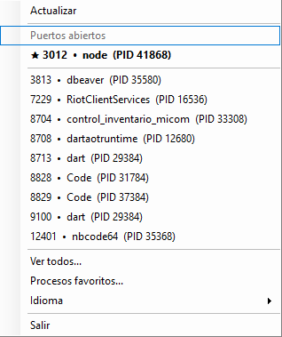
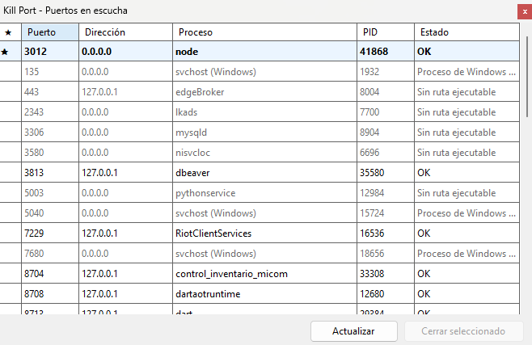
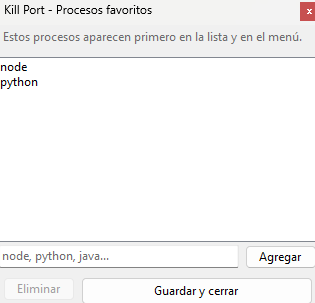

# Kill Port

Kill Port is a lightweight Windows tray utility for inspecting listening TCP ports and safely terminating eligible user-level processes. It focuses on local TCP listeners, protects Windows and system processes from being closed, supports English and Spanish, and stores favorites and language preferences locally.

## Features

- Runs as a Windows system tray application with a compact context menu.
- Shows quick-close actions for eligible listening ports directly from the tray menu.
- Opens a full listening-port window with port, address, process name, PID, and status.
- Prioritizes favorite processes in both the tray menu and the full list.
- Automatically refreshes the full list every 5 seconds.
- Supports English and Spanish UI switching at runtime.
- Blocks protected Windows and system processes, including `svchost`, from being terminated.
- Installer can optionally register the app to start with Windows for the current user.

## Screenshots

<p align="center">
  
  
  
</p>

## How It Works

- Kill Port reads the Windows TCP listener table and collects listening TCP ports that belong to running processes.
- Each listener is resolved to a PID, process name, and executable path when available.
- Entries are marked as non-closable when the process cannot be resolved, the executable path cannot be read, the executable is under the Windows directory, or the process is `svchost`.
- The tray menu shows a short list of closable ports for quick access, while the full window shows all detected listening entries.
- When closing a process, Kill Port first attempts a graceful window close and then falls back to terminating the process if it is still running.
- If Windows denies access, the app reports that elevation is required.
- Favorites and language settings are stored in `%AppData%\KillPort\settings.json`.

## Requirements

- Windows x64
- .NET 10 SDK for local development
- Inno Setup 6 only if you want to build the installer

## Installation

### Option 1: Use the packaged installer

Download the latest `KillPort-Setup.exe` from the repository Releases page and run it.

The installer:

- installs the app per user
- can create a desktop shortcut
- can optionally register Kill Port to start with Windows

### Option 2: Build locally from source

Clone the repository and use the commands in the build section below.

## Usage

1. Launch Kill Port. The app starts in the Windows tray.
2. Right-click the tray icon to refresh, open the full port list, manage favorite processes, switch language, close an eligible process quickly, or exit.
3. Double-click the tray icon to open the full listening-port window.
4. In the full list, review the port, address, process, PID, and status columns.
5. Select a closable entry and confirm the action to terminate the owning process.
6. If access is denied, restart the app as administrator and try again.

Protected or unresolved processes are intentionally shown but cannot be closed from the app.

## Build From Source

Run these commands from the repository root:

```powershell
dotnet build KillPort.sln
dotnet test KillPort.App.Tests\KillPort.App.Tests.csproj
dotnet run --project KillPort.App\KillPort.App.csproj
.\Build-Installer.ps1
```

Notes:

- `dotnet test` runs the safety-policy tests that validate which processes are closable or blocked.
- `dotnet run` launches the tray application directly.
- `Build-Installer.ps1` publishes the app into `publish\` and then builds `KillPort-Setup.exe`.
- Building the installer requires Inno Setup 6 to be installed.

## Project Structure

- `KillPort.App/Program.cs` - application entry point and dependency wiring
- `KillPort.App/Services` - TCP listener scanning and process termination logic
- `KillPort.App/UI` - tray menu, full port list window, and favorites UI
- `KillPort.App/Localization` and `KillPort.App/Settings` - UI strings and persisted user settings
- `Build-Installer.ps1` and `KillPort.iss` - publish and installer packaging workflow

## Contributing

Issues and pull requests are welcome.

If you contribute:

- keep changes focused and easy to review
- test on Windows x64
- avoid weakening safety checks around Windows and system processes unless the change is explicitly justified
- update documentation when behavior changes

## License

This project is licensed under the MIT License. See the [LICENSE](LICENSE) file for details.
